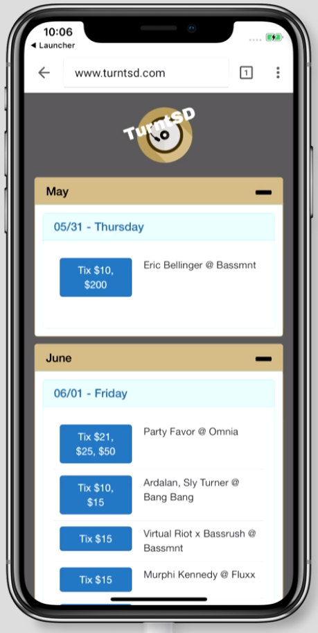

# TurntSD

Rewriting [TunrtSD](http://turntsd.com) w/ Angular. woot

TurntSD started as a hobby project to learn AngularJS. This is only the web app portion but there is also a C# script that does the heavy lifting - scraping data from various clubs in the San Diego area and aggregating DJ events / prices and provides a link straight to the ticket page.

   

